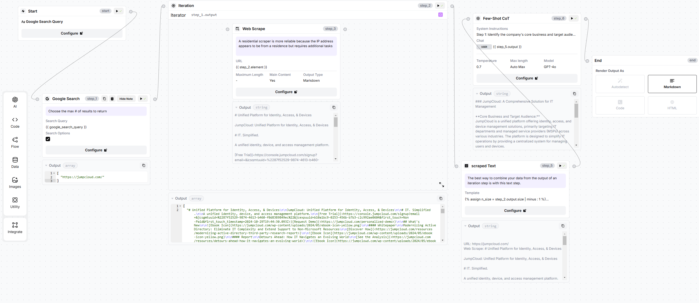
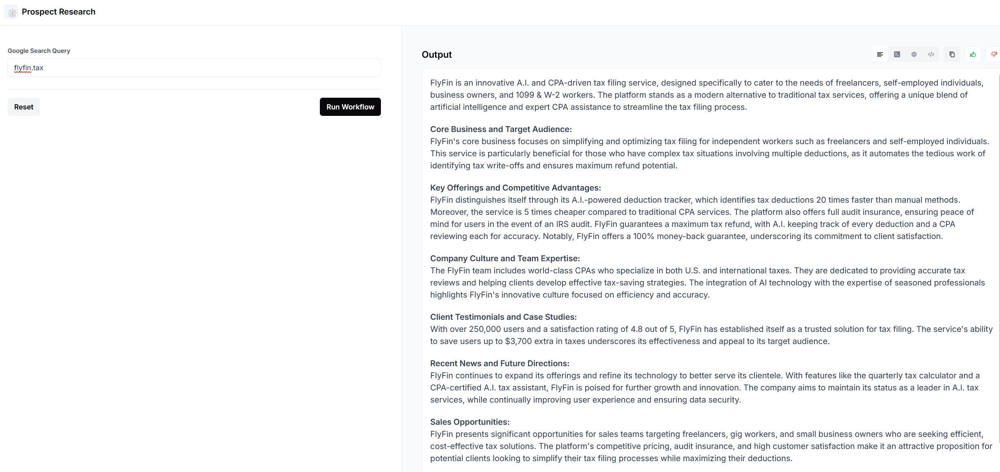

## Automation using AirOps

🔗 https://app.airops.com/public_apps/a5b053ed-3a94-4fc8-96cc-cec1878a62b7/run

New updated workflow with much richer data : 

🔗 https://app.airops.com/public_apps/cf4a3c94-36e1-4efa-a4dd-51a37862921e/run

### About Me : 

Ever since starting my master’s degree, I’ve been fascinated by large language models (LLMs) and how they’ve changed the way we learn. Tasks that used to take at least an hour, like getting the gist of a research paper, now take me about 10 minutes. I still explore the details, but LLMs make it much easier to understand the main ideas quickly. This interest led me to experiment with LLMs and prompts, pushing the models’ capabilities to see what they could achieve.

Working on something I’m genuinely interested in is important to me, and for me, that’s LLMs. I’m drawn to how GrowthX uses them in its marketing strategies and operations, and I’d be excited to bring my passion to a team where I can also keep learning about new advancements in the field.

I’m passionate about AI automation because it brings efficiency to repetitive tasks, giving people more time to focus on creative and strategic work. What excites me most is the potential to build systems that not only save time but also improve accuracy in decision-making. Automating processes through AI allows for faster insights, minimizes human error, and lets teams spend more time on tasks that require human judgment.

I enjoy the problem-solving aspect of designing workflows and automations that meet specific needs. Each project is a chance to create something that makes work easier and smarter, which is incredibly satisfying.

At the ShellHacks 2023 hackathon, I developed a multifunctional application for analyzing customer service conversations. The app enabled audio input, playback, and transcription, using Assembly AI’s speaker diarization to accurately distinguish between speakers and convert spoken content into text. This feature was essential for maintaining a clear record of dialogue and ensuring accurate transcription.

I also integrated Cohere AI for summarization and sentiment analysis, giving users instant insights into key points and the overall tone of conversations. This was particularly helpful for gauging customer satisfaction and quickly identifying trends in user sentiment. Additionally, I added download options so users could save both audio and text files for offline access.

Although I forgot to submit the project after working on it for 36 hours straight and then crashing for some much-needed sleep, the experience was incredibly valuable. I learned a lot about using APIs, integrating different functionalities, and building a fully functional application. Despite the missed submission, I gained hands-on skills and experience that I’m excited to bring to future projects.

During the ShellHacks hackathon, I faced several challenges that required me to quickly learn new skills to complete the project. Working with JSON data and integrating multiple APIs was new territory, and I quickly realized that handling complex JSON structures was trickier than anticipated. Parsing nested data and mapping it correctly to my app’s functionalities was an unexpected struggle, as I encountered issues with data formats and structure mismatches.

API errors also became a recurring obstacle. Some errors were vague, which made it hard to troubleshoot and understand what went wrong. I spent a lot of time researching best practices for error handling, setting up detailed logging, and learning to interpret API documentation more effectively. Through trial and error, I found ways to better manage errors and set up fallback responses, ensuring the application was more stable and user-friendly.

Though this process was challenging, it was incredibly rewarding. I learned a lot about working with JSON, error handling, and API troubleshooting, skills that have since strengthened my technical abilities and problem-solving approach.

### Normal summarization vs Few-Shot Chain-of-Thought (CoT) :

If we ask an LLM to summarize given text, it will indeed summarize it. However, the summary might not always align with our specific needs. LLMs may inadvertently omit important information that we consider crucial, as we haven't provided explicit guidance on what to prioritize or emphasize.
On the other hand, few-shot Chain-of-Thought  prompting offers a more structured approach. By providing the LLM with a clear framework, we can guide its reasoning process and ensure that it focuses on the most relevant aspects of the text. Giving us a more accurate and informative summaries that better meet our requirements.

Few-Shot Chain-of-Thought Prompt : 

#### Step 1: Identify the company's core business and target audience.
#### Step 2: Summarize the company's key offerings and competitive advantages.
#### Step 3: Analyze the company's culture and team expertise based on employee profiles.
#### Step 4: Highlight any relevant client testimonials or case studies.
#### Step 5: Summarize recent company news and potential future directions based on blog posts.
Synthesize all the information above into a concise and informative article suitable for a sales team, focusing on potential sales opportunities.

### AirOps Workflow :

I was tinkering with LangFlow a while ago, so I wanted to create a workflow with it. However, I found that the cloud version of LangFlow has fewer components than the local version. So, I turned to the first tool mentioned in the list, AirOps. The interface was quite intuitive and self-explanatory.

I started with a blank workflow and added a Google Search Query component, allowing users to input a company URL. This input was then passed to a Google Search component. Next, I incorporated a Scraper component to extract relevant information from the website. The scraped text was then fed into an LLM (ChatGPT) component, along with the prompt we discussed earlier. Finally, the LLM generated a summary of the company, including its activities, target audience, other details