# Abstract

This study investigates the multifaceted nature of crime in Los Angeles between 2020 and 2023 by analyzing official LAPD data to uncover intricate patterns and nuances across temporal, spatial, demographic, and crime-type dimensions. Spatial analysis identifies high/low crime areas and hotspots through geographic mapping. Victim demographics are correlated with crime types, locations, and times. Prevalent crimes are categorized, and their patterns are assessed in relation to reporting times and proximity to police stations. Connections between crime types and arrest rates are explored. The findings reveal an upward trajectory in reported crimes, peaking in 2022, with weekends and holidays exhibiting heightened activity. Geographically, Central, 77th Street, and Pacific emerge as hotspots, while Mission, Hollenbeck, and Foothill exhibit lower rates. Males, middle/young adults, and individuals of Hispanic/Latin/Mexican descent face disproportionate risks. Vehicle theft, assault, and burglary are prevalent, with police effectively solving severe crimes but facing challenges with petty offenses. This comprehensive analysis elucidates the intricate patterns and trends underlying crime in Los Angeles, providing valuable insights to inform data-driven crime prevention strategies, targeted interventions, resource allocation, community engagement, and support mechanisms tailored to specific vulnerabilities and crime types.

# Introduction

Crime is a complex issue with a significant impact on society, both socially and economically. Understanding the patterns and trends of crime is crucial for developing effective strategies to prevent it. This study delves into crime data for Los Angeles, utilizing official records provided by the Los Angeles Police Department (LAPD). Our investigation aims to shed light on the intricacies of crime within the city through a multifaceted analysis.

We begin by exploring crime trends over time. This includes examining overall changes in crime rates and any potential seasonality in crime occurrence. Additionally, we will investigate how the daily rhythms of the city influence crime patterns, identifying the times of day when specific crime types are most frequent.

Spatial analysis is another key component of our investigation. By analyzing crime data in relation to zip codes, we aim to identify areas with high and low crime rates. Heatmaps will be utilized to visualize these spatial patterns, providing a nuanced understanding of crime hotspots within the city.

The demographics of crime victims are also a critical area of focus. We will analyze victim characteristics such as age, sex, and ethnicity to uncover potential correlations with the types of crimes experienced, the locations where they occur, and the time of day.

This study will identify the most prevalent crime types within Los Angeles. We will explore patterns and trends in their occurrence across different areas and over time. Furthermore, by analyzing police response data, we will investigate the relationship between crime types, reporting times. Additionally, we will examine connections between specific crimes and arrest rates.

Our investigation extends beyond these initial analyses. We will explore how the frequency of specific crimes has evolved over the years, examining potential increases or decreases in crime prevalence.  Furthermore, we will investigate if crime patterns shift during significant events or holidays.

By comprehensively analyzing LAPD crime data, this study seeks to illuminate the underlying patterns and trends of crime in Los Angeles.  The insights gained from this multifaceted approach can empower data-driven strategies to enhance public safety and implement targeted crime prevention initiatives throughout the city. 

# Data

The LAPD crime data provides a comprehensive record of criminal incidents reported within Los Angeles, offering a detailed insight into various aspects of each event. Each entry in the dataset is represented by a unique DR\_NO identifier and includes key information such as the date and time the crime was reported (Date Rptd and Time Occ), the date of occurrence (DATE OCC), and the geographical location (LAT and LON). Additionally, the data contains categorical variables such as the reporting area (AREA and AREA NAME), the type of crime reported (Crm Cd and Crm Cd Desc), and details about the victim including age (Vict Age), sex (Vict Sex), and descent (Vict Descent). Furthermore, the dataset includes information on the premises where the crime occurred (Premis Cd and Premis Desc), any weapons used (Weapon Used Cd and Weapon Desc), and the current status of the case (Status and Status Desc). Moreover, the data includes multiple columns for crime codes (Crm Cd 1, Crm Cd 2, Crm Cd 3, Crm Cd 4), offering a comprehensive classification of the offenses. Lastly, location details such as cross streets (Cross Street) and Modus Operandi(Mocodes) provide further context to each reported incident, enabling a thorough analysis of crime patterns and trends within the city.

To enhance public understanding and facilitate location analysis, we addressed the challenge of mapping between the LAPD's reported district numbers (Rpt Dist No) and zip codes. This involved utilizing an external dataset containing zip code information. However, due to the nature of police reporting districts, which may encompass multiple zip codes, a perfect one-to-one match wasn't always possible. In these instances, where a reported district number overlapped with several zip codes, we selected a single zip code randomly. While this introduces a slight element of approximation, it ultimately allows us to present crime data within a geographical framework that aligns with how residents typically identify their locations. By employing zip codes, our analysis and visualizations become more relatable and accessible to the public.

# Analysis

## Temporal Analysis

### What is the trend in the number of reported crimes over the years?

Los Angeles crime data reveals an upward trend with some recent fluctuations. Reported crimes increased by
4.994% from 2020 to 2021. This trend continued with a sharper rise of 12.006% from 2021 to 2022. However,
there was a slight decrease of 1.908% in reported crimes between 2022 and 2023.

")

Crime rates in 2020 remained relatively consistent throughout the year. In 2021, reported crimes averaged around 17,000 from January to June. However, there was a significant increase of 10\% in crime for the remainder of the year. Notably, 2022 saw the highest annual crime rate, with May having the most reported incidents. This trend appeared to continue into early 2023, with January experiencing a high number of crimes. The remainder of 2023 showed a decrease in crime rates, except for a rise in December.

")

### Is there any seasonality in the occurrence of crimes based on the day of occurrence ?

An interesting trend emerges when analyzing crimes by day of the week across different years. The data suggests a consistent weekly pattern throughout the years, with Fridays consistently recording the highest number of crimes, followed by Saturdays. Wednesdays also tend to see a higher number of crimes compared to the rest of the weekdays, which exhibit relatively similar crime rates. 

")

### Do crimes peak during the US holiday season?

* **Consistent Holiday Impact** : Holidays (2020-2023) consistently spike in crime regardless of weekday, as holidays fell on every weekday during this period.

* **Year-Specific Trends** : Crime spikes occurred on Wednesdays and Saturdays (2020), Thursdays and Fridays (2021), Mondays and Thursdays (2022), and Mondays (2023) during holidays.
* **Increase in Average Crimes** : The plots shows a potential rise in average daily crimes across the four years.

")

Dips indicate no holidays on those weekdays.

The below bar plot shows that New Year's Day reigns supreme (2020-2023) as the peak day for crimes across all years during the holiday season. Noticeably, crimes are less during Christmas.

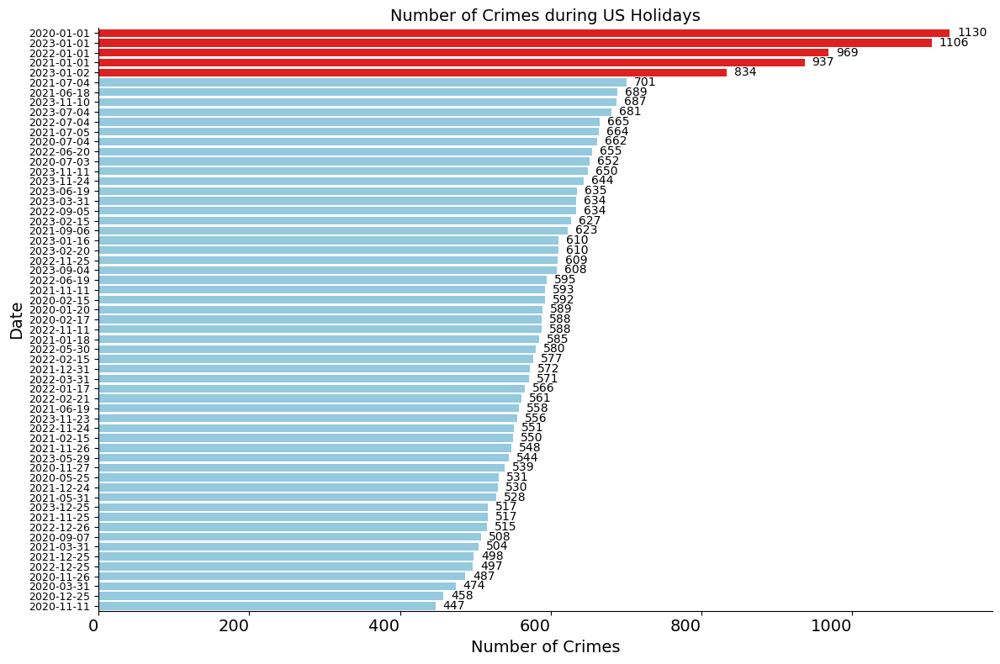

### At what times of day (TIME OCC) do different types of crimes (Crm Cd Desc) tend to occur most frequently?

* **Crime Distribution by Time** : Afternoon (12PM-4PM) reigns supreme, followed by evening and night. Mornings, early mornings, and late nights see a significant drop in criminal activity.

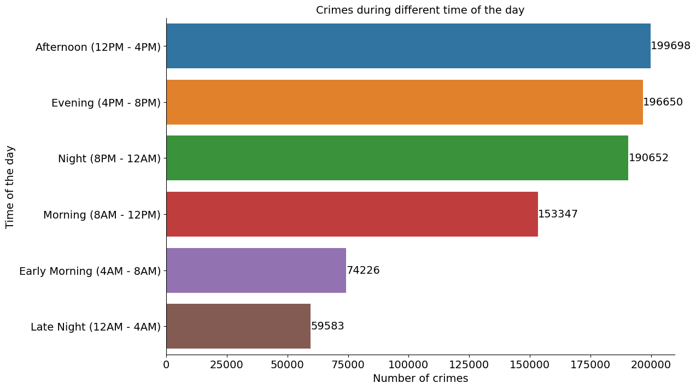

### Top crimes during each time of the day

* **Nighttime Dominates Vehicle Crimes**** : Theft reigns supreme during the cloak of night (8 PM - 12 AM), with vehicle thefts significantly outpacing other crimes. Burglary of vehicles also follows this nocturnal pattern, peaking at night.

* **Simple Assault's Midday Surge** : Simple assaults rise from early morning (4 AM - 8 AM), cresting during the afternoon hours (12 PM - 4 PM), and then gradually decline as night falls.

* **Plain Theft Mirrors Simple Assault** : Plain theft exhibits a similar trajectory to simple assault, rising steadily throughout the day, peaking in the afternoon, and significantly dropping as night approaches. However, unlike simple assault's gradual decline, plain theft drops more sharply.

* **Domestic Crimes and Identity Theft Seek Daylight** : Intimate partner assault and identity theft favor the daylight hours, peaking in the afternoon and hitting their lowest points at night (8 PM - 12 AM).

* **Vandalism and Aggravated Assault Thrive as Day Progresses** : Both vandalism and aggravated assault follow a similar path, gradually increasing throughout the day and reaching their peak at night.

* **Potential Reasons for These Patterns** : While the reasons behind these time-based trends are complex, some possibilities emerge. Afternoon's bustle might provide opportunities for opportunistic crimes like pickpocketing and simple theft. Conversely, the darkness of night could be a catalyst for bolder crimes like vehicle thefts and vandalism.

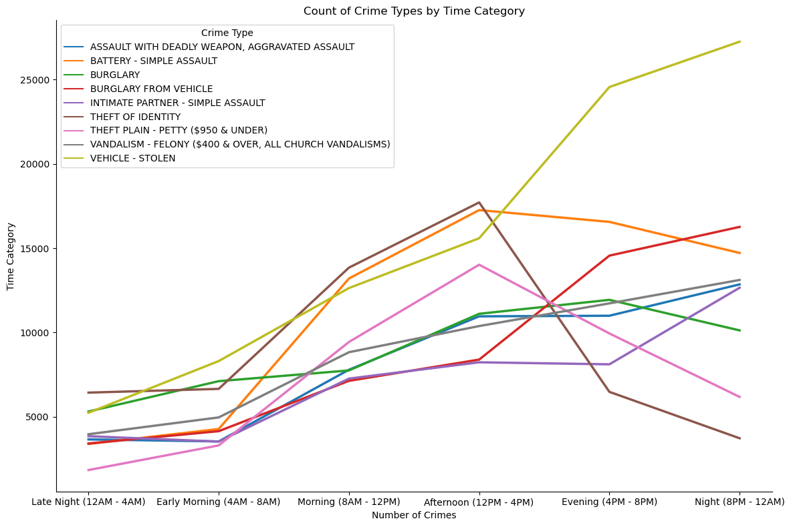

### How has the frequency of specific types of crimes evolved over the years?

**Vehicle Theft Reigns Supreme, Identity Theft Spikes in 2022**

* **Analysis of crimes from 2020 to 2023 reveals a clear leader : vehicle theft.** This crime type
significantly outpaces all others, showcasing a dominant presence throughout the period. Interestingly,
theft of identity exhibits an unusual pattern, peaking once in 2022.

**Simple Assault and Burglary: Similar Trends, Different Scales**

* Simple assault and burglary display remarkably similar trends over the years, suggesting a potential
correlation. However, burglary occurs considerably less frequently. This might indicate a shift in criminal
tactics, with fewer forceful entries and more opportunistic thefts.

**Gradual Increase Across Crimes**

*  **A concerning trend emerges** : a gradual increase in most crime types except for the isolated peak in
identity theft.

**Burglary Paradox: Vehicle vs. Property**

*  An intriguing observation lies in burglary. Interestingly, burglary from vehicles topped regular burglary
for three consecutive years (2020-2022). However, 2023 saw a shift with regular burglary taking the lead.
It could potentially signal a change in criminal targeting or security measures.

### Are there any noticeable trends in the temporal distribution of crimes during significant events or holidays?

**Holiday Season Crime Trends: A Mixed Bag**

This analysis reveals a mixed bag of changes in crime rates during holiday seasons from 2020 to 2023.

* **Significant Increases:**
    * **Intimate Partner Assault** : A concerning rise of 17.17% in intimate partner assaults during holidays
    * **Theft of Identity** : A substantial increase of 15.06% in identity theft during holidays.
    * **Aggravated Assault** : A significant increase of 11.38% in aggravated assaults during holidays.

* **Minimal Changes:**
    * **Vandalism (Church)** : A modest increase of 4.82% in vandalism targeting churches during holidays.
    * **Theft from Motor Vehicle** : A very minor change of 1.41% in theft from motor vehicles during
holidays.
    * **Burglary** : A slight increase of 0.79% in burglaries during holiday

* **Decreases:**
    * **Plain Theft** : A welcome decrease of 5.51% in plain thefts during holidays.
    * **Burglary from Vehicle** : A slight decrease of 2.56% in burglaries from vehicles during holidays.
    * **Vehicle Theft** : A decrease of 1.31% in vehicle thefts during holidays, marking the steepest decline.

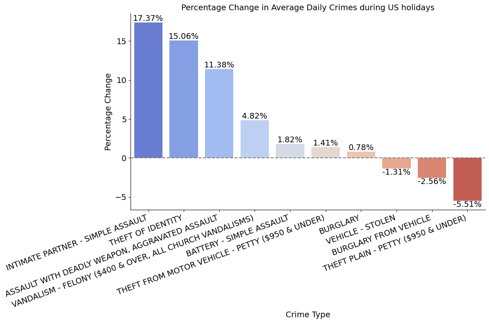 

## Spatial Analysis

### Which areas (AREA NAME) have the highest and lowest crime rates?

**Crime Hotspots and Safe Havens during 2020-2023**

")

* **High-Crime Areas:**
    * **Central, 77th Street, and Pacific** : These areas emerge as significant concerns, consistently experiencing high crime incidents, exceeding 50,000 each over the analyzed period.

        ")

* **Low-Crime Areas:**
    * **Mission, Hollenbeck, and Foothill** : Fortunately, these areas stand out for their considerably lower
    crime rates. Throughout the analyzed period, they each reported fewer than 35,000 crime incidents.
        ")

        ")

##  Victim Analysis

### What are the demographics (Vict Age, Vict Sex, Vict Descent) of crime victims?

**Crime Victims: Male, Female, and the Unknown**

* Analysis reveals the distribution of crime victims by gender are Males, Females, and a concerningly high
number of cases with unknown gender. While males appear to be the most frequent victims, followed
by females, the significant number of unknown genders makes it difficult to draw definitive conclusions.

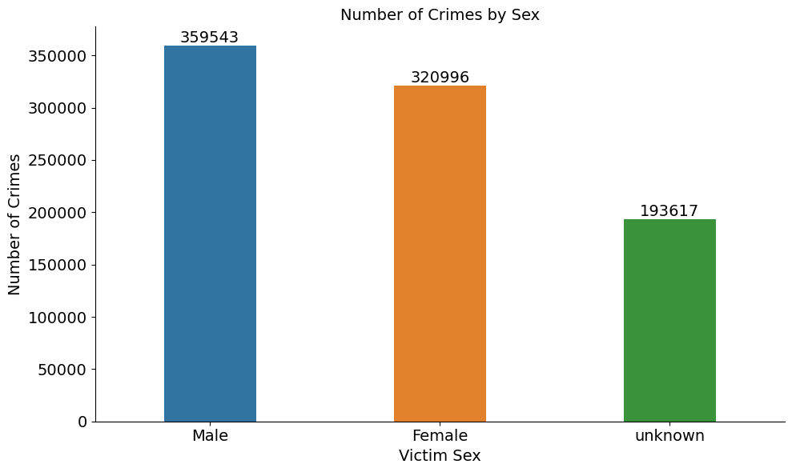

### Types of Crime based on Victim Descent

**Racial Disparities in Los Angeles Crime:**

* **Black victims** experience a higher rate of simple assault , followed by aggravated assault and theft of
identity. This suggests a need for further investigation into the factors contributing to this specific trend.
    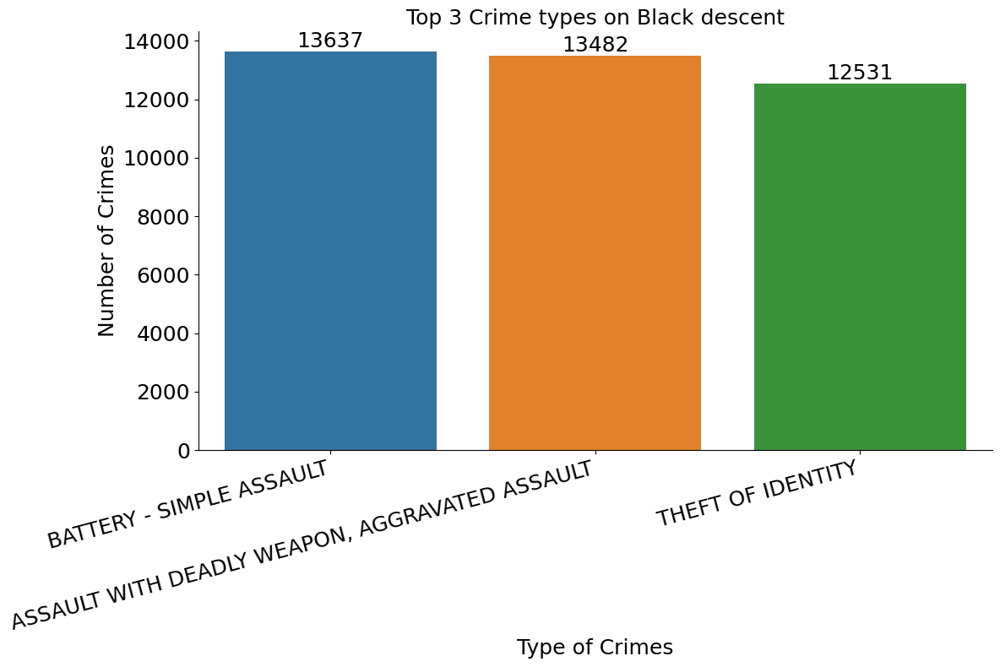
* **Hispanic/Latin/Mexican** victims face a higher rate of simple assault as well, followed by aggravated
assault and a concerningly high rate of intimate partner assault. This data highlights the importance of
culturally sensitive resources and support programs to address domestic violence within this community.
    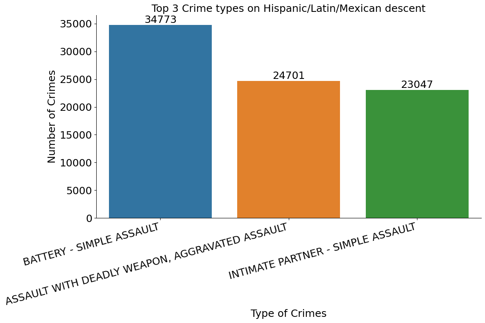
* **White victims** experience the most incidents of burglary from vehicle, followed by burglary and theft
of identity. This suggests property crimes may be a bigger concern for this demographic.
    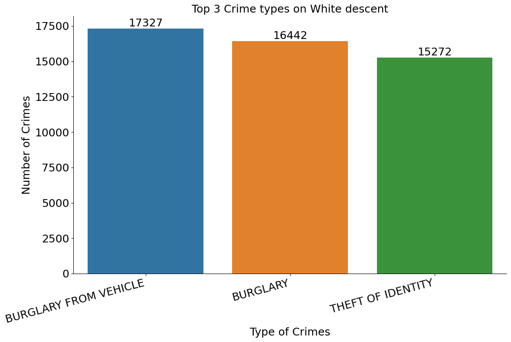

###  Number of Crimes by Age group (2020-2023)

* **Middle Adults (35-64) & Young Adults (20-34)** : These age groups are the most frequent targets
of crime.
* **Seniors (65+)** : Fortunately, seniors appear to be less impacted by crime compared to younger age
groups.
* **Infants (1-2)** : While crimes against infants are thankfully the least frequent, any such instance is a
serious concern.

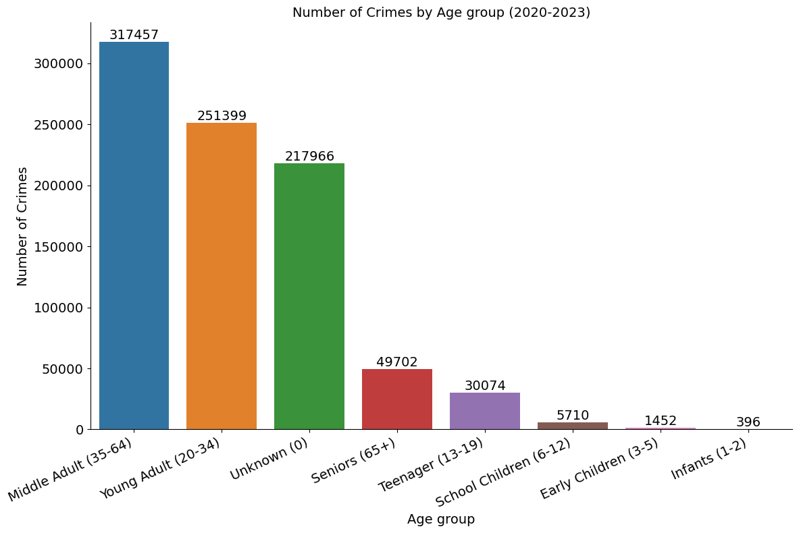

###  Do certain age groups experience specific types of crimes more frequently?

* **Unknown Age** : Crimes against people of unknown age are overwhelmingly dominated by stolen vehicles. This highlights the need for improved data collection.
    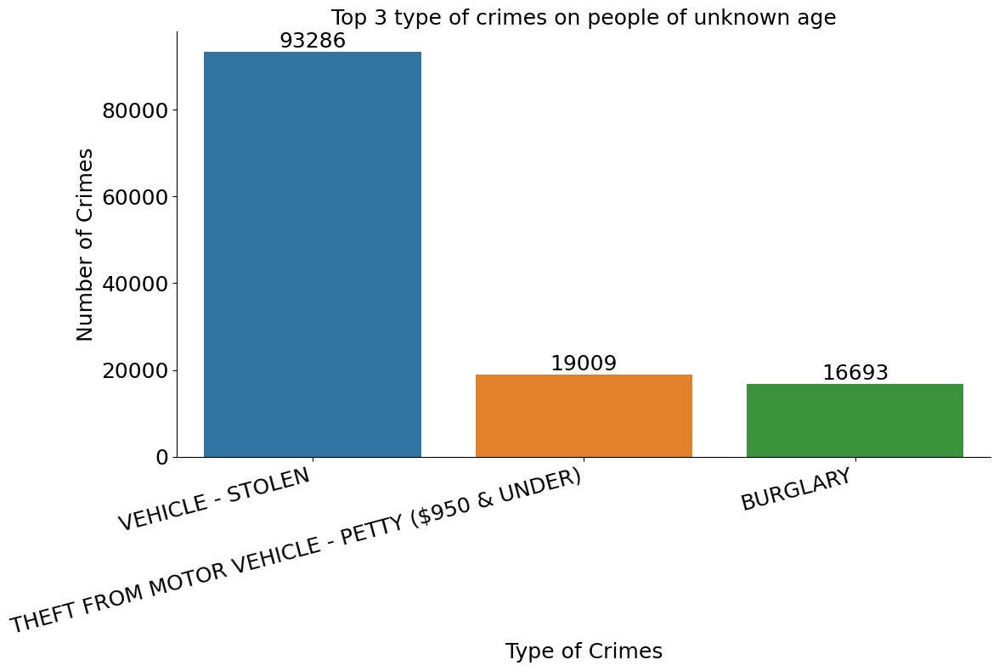
* **(Infants (1-2))** : Tragically, the most common crimes faced by infants are child neglect and child abuse.
    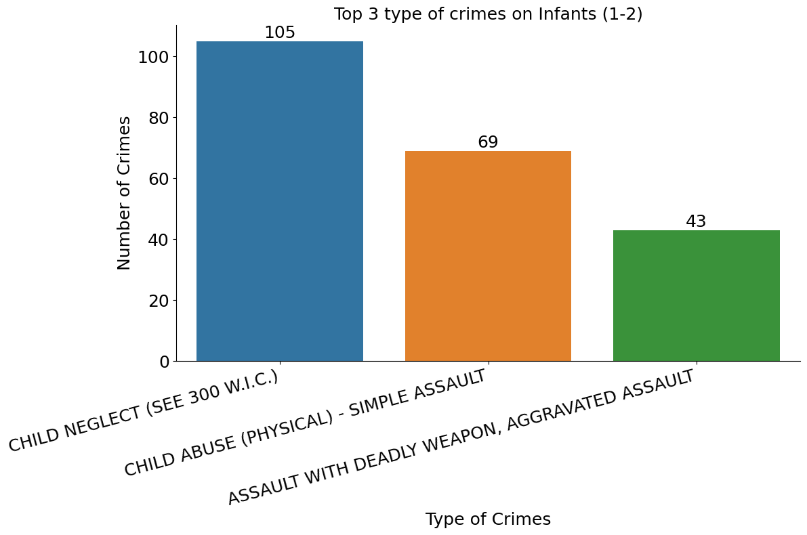
* **Children (3-5)** : Child abuse is the most frequent crime against young children, followed by child neglect
and crimes by teenagers.
    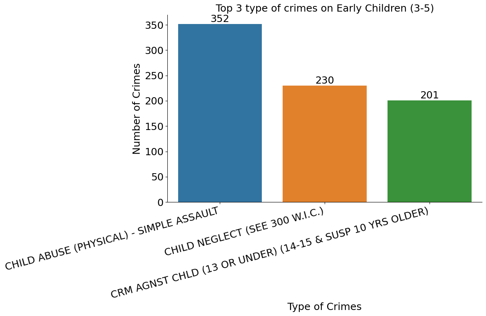
* **School Children (6-12)** : Child neglect remains the highest concern, followed by crimes by teenagers
and simple assault.
    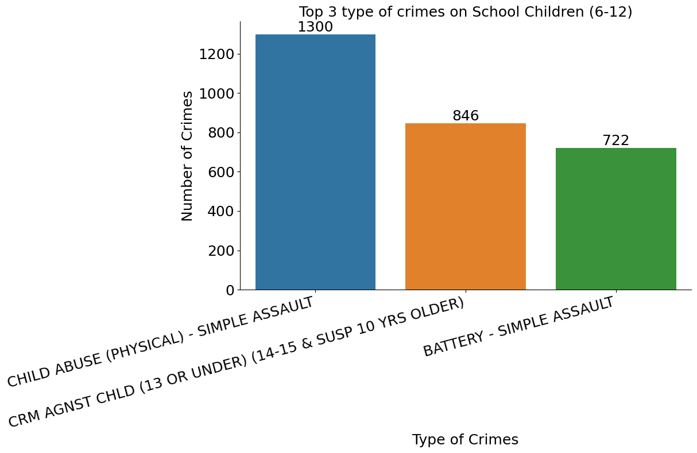
* **Teenagers (13-19)** : Simple assault tops the list for teenagers, followed by aggravated assault and
robbery. This highlights the need for targeted interventions to address violence among this age group.
    
* **Young Adults (20-34)** : Crimes against young adults are dominated by burglary from vehicle, followed
by simple assault and intimate partner violence (simple assault).
    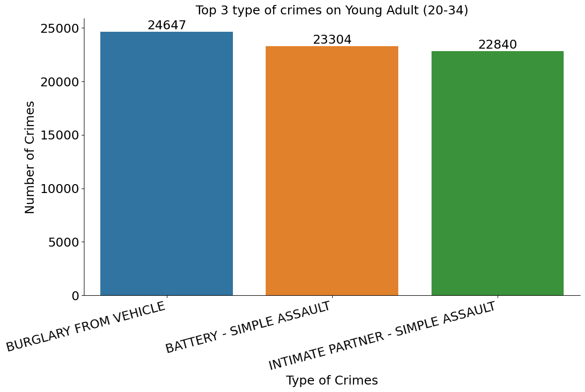
* **Middle Adults (35-64)** : Simple assault is the most common crime faced by middle adults, followed
by theft of identity and burglary from vehicle.
    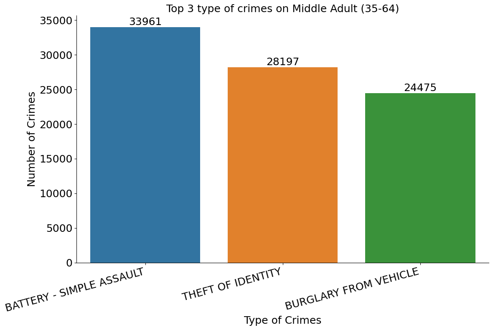
* **Seniors (65+)** : Burglary poses the biggest threat to seniors, followed by simple assault and theft of
identity. Seniors might be perceived as easier targets due to potential physical limitations. Home security
measures, perpetrator awareness campaigns, and financial security education are important for this age
group.
    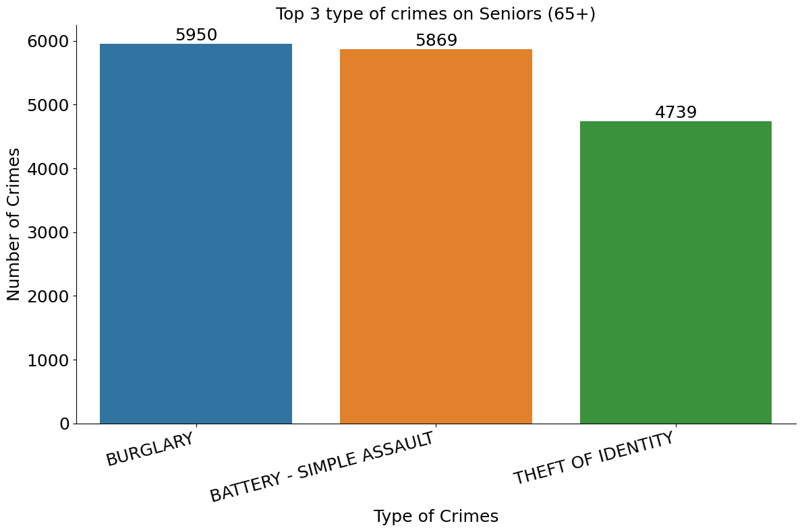

### Crime count based on Descent

Breakdown of crime victims by ethnicity reveals that Hispanic/Latin/Mexican descent appears to be the most
frequent, followed by White, black descents. However, a significant portion (21.5%) of cases lack ethnicity
information. This makes it difficult to draw definitive conclusions about the impact of crime on different ethnic
groups.

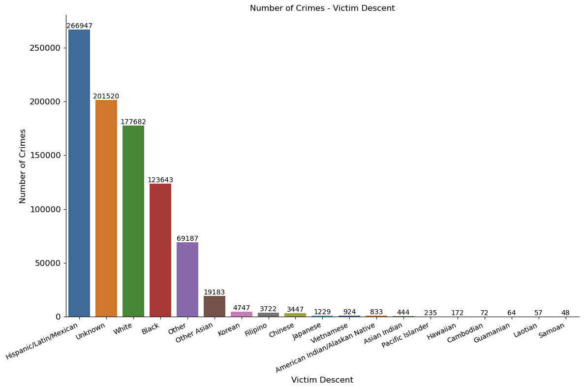

### Distribution of Crimes across different geographical areas of LA based on Victim Descent

* **Black Descent** : The highest number of crimes against people of Black descent occur in 77th Street,
followed by Southeast and Southwest.
* **Hispanic/Latin/Mexican Descent** : Crimes against Hispanic/Latin/Mexican residents are most prevalent in Newton, Mission, and 77th Street.
* **White Descent** : Areas with the highest number of crimes against white residents are Pacific, West
LA, and Hollywood.
* **Unknown Descent** : Crimes against people of unknown descent are most frequent in Pacific, 77th
Street, and Southwest.

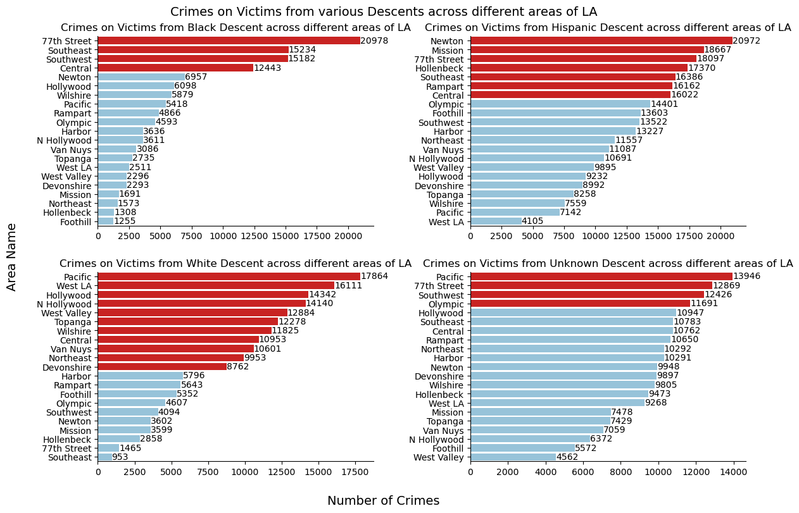

## Crime Classification Analysis

### What are the most common types of crimes (Crm Cd Desc) reported in the dataset?

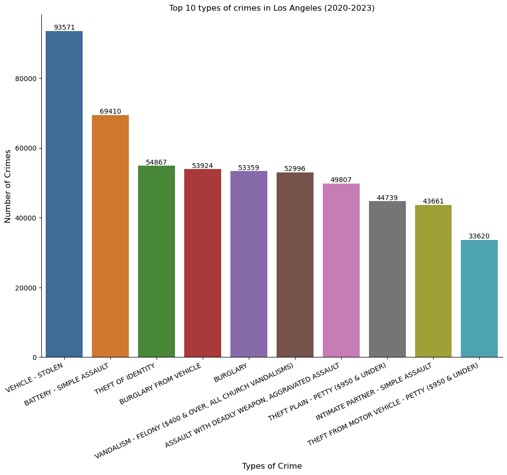

##  Police Response Analysis

### Is there any correlation between the time it takes to report a crime and its severity or type?

* Crime with lowest reporting times:
    * Disrupt school, purse snatching
    * Firearms violations (protective/restraining orders, replica firearms)
    * Petty theft (auto repair)
    * **Serious Crimes** : Notably, some serious offenses, such as lynching and bomb scares, appear on this list.

* **Potential Skew** : It’s important to consider that a low number of incidents for some crimes (like petty
theft, purse snatching) might influence the average reporting time, making them appear alongside more
serious offenses.

    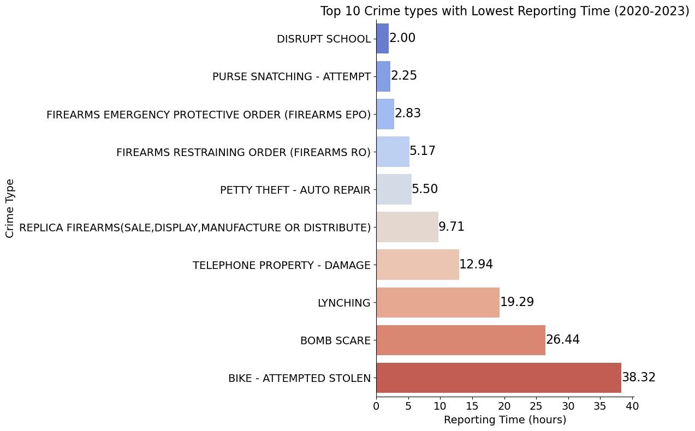

**Some serious crimes, including those of a sensitive nature, may experience delayed reporting for various reasons:**

* **Fear of Reprisal** : Victims of crimes like manslaughter may hesitate to report due to concerns about
potential retaliation or threats to their safety.
* **Complexity of Recognition** : Offenses such as Child Abandonment, sexual penetration with a foreign
object, bigamy, and lewd acts with a child can be intricate and may require time for victims to fully
comprehend what has happened before they feel ready to report.
* **Stigma and Privacy Concerns** : Crimes involving sexual offenses often carry significant stigma, leading
victims to delay reporting out of fear of judgment or embarrassment.

While crimes related to sexual offenses often exhibit high reporting times due to stigma, other serious
offenses like manslaughter and child abandonment may also experience delays, albeit for different reasons

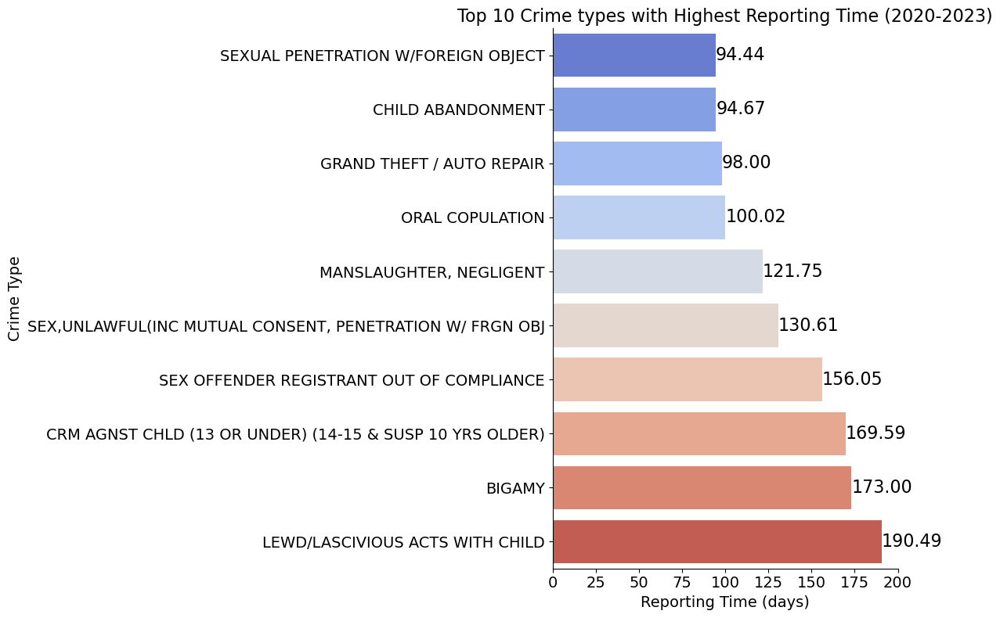

### Any relation between type of crime and arrests ?

**A Focus on Solving Serious Crimes**

* **High Clearance Rates for Severe Crimes** : Crimes like manslaughter, lynching, intimate partner
assault, and pandering show a high case resolution rate, exceeding 71% arrest. This indicates a strong
emphasis on swiftly apprehending individuals involved in these serious offenses.
* **Priority on Child Abuse** : Crimes against children, including child stealing, neglect, simple assault,
and aggravated assault, also boast a significant clearance rate of over 66.8%. This highlights a commendable focus on protecting vulnerable youth.

    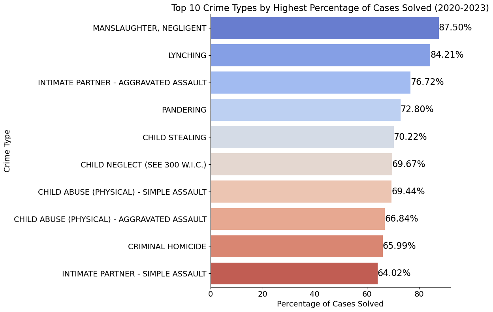

**The Challenge of Petty Theft**

* **Low Clearance Rates for Petty Thefts** : Crimes like till taps (petty theft) and bunco (grand theft,
petty theft, attempt) have very low case resolution rates, hovering around 3-4%. This suggests significant
challenges in identifying and apprehending perpetrators of these offenses.
* **Unsolved Burglary and Vehicle Theft** : Burglary from vehicle and theft from motor vehicle (both
grand and petty theft) also show concerningly low clearance rates, typically below 2%. Similar to bunco
schemes, these crimes might be difficult to investigate due to the lack of easily identifiable evidence.

    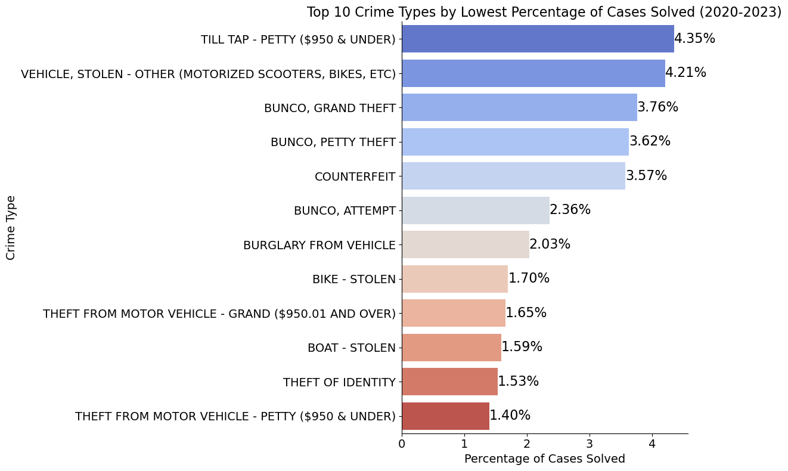

# Conclusion

Analysis of Los Angeles crime data (LAPD) (2020-2023) reveals a concerning rise, with 2022 seeing the highest
annual rate. Weekends, especially Fridays, and holidays correlate with spikes in crime, suggesting a link to
leisure time. Interestingly, the data exposes clear geographical patterns. Areas like Central, 77th Street,
and Pacific are crime hotspots, while Mission, Hollenbeck, and Foothill experience lower crime rates. Victim
demographics also show disparities. Males, middle and young adults, and Hispanic/Latin/Mexican individuals
face higher risks. Additionally, the analysis highlights the prevalence of vehicle theft, simple assault, and
burglary. While police excel at handling serious crimes, lower clearance rates for petty thefts and vehicle
crimes pose a challenge. This data offers valuable insights for stakeholders. By understanding these patterns,
they can develop targeted strategies to reduce crime, improve community safety, and create inclusive solutions
that address the specific needs of vulnerable populations.

# References
1. [Arrest Data from 2020 to Present. (n.d.). Los Angeles Open Data.](https://data.lacity.org/Public-Safety/Arrest-Data-from-2020-to-Present/amvf-fr72/about_data)
2. [Reporting Districts API. (n.d.). Los Angeles GeoHub.](https://maps.lacity.org/arcgis/rest/services/Permits/BOE_Permits_Geocoder/MapServer/402)
3. [seaborn: statistical data visualization.](https://seaborn.pydata.org/)
4. [matplotlib: Visualization with Python.](https://matplotlib.org/stable/index.html)
5. [folium 0.12.1 documentation.](https://python-visualization.github.io/folium/latest/reference.html)

