## Introduction
### 1.1 Background
This study focuses on **how** & **what** factors affect the growth of a startup. A Startup can be defined as a process when an individual or group of people start with an idea to solve a problem. Not only services but startups also products that can revolutionize the market.

As simple as it is, a picture can tell much more than words. But, picture itself won't be enough for others to understand what we want to convey. Charts that will be shown are based on analysis done with specific questions in mind. I wanted to analyze the data based on some important factors such as **funding amount, funding rounds, location, category of the startup (market)**.

My analysis focuses on showing the role of important factors and their impact on success or failure of a startup.

### 1.2 Data

* The [data](https://www.kaggle.com/datasets/arindam235/startup-investments-crunchbase) was obtained from Kaggle datasets provided by Crunchbase.
* Data consists of startup's name, founded date, total funding amount, funding rounds and much more.

## Methodology

Dataset consists a lot of redundant data which would not be necessary for my analysis. The data is cleaned to have only necessary columns and corrupted data was modified to make it usable for the analysis. The analysis is done in multiple stages, each depending on a factor. Finally the results obtained from the analysis will be useful in reducing the time taken for making critical decisions.

### 2.1 Data cleaning

* The dataset contains lot of redundant columns regarding dates, for which I converted them into one column named as founded_year.
* location data had lot of inconsistent and wrong location names which were modified to correct names.
* Companies with no funding data were removed.
* While the data consists data of companies from 1900's, the data during 1990-2014 was only considering to relate to latest trends.
* Following are the columns used in this study:
    * name: name of the startup  
    * market: market/category to which the startup belongs to. 
    * funding_total_usd: Total funding received by the startup in USD. 
    * status: Tells the status of startup whether it is operating / acquired / closed.  
    * funding_rounds: How many times did the startup receive funding.  
    * founded_year: In which year the startup was founded.  
    * location: location where the startup was founded.

### 2.2 Data Analysis

* Python is the programming language used.
* Pandas for tabulating the data and performing operations on data.
* Matplotlib for plotting the charts.
* foursquare api for translating the location names to coordinates.
* folium for plotting pointers on world map.
* joblib for serializing the coordinates to avoid converting the location names to coordinates multiple times.

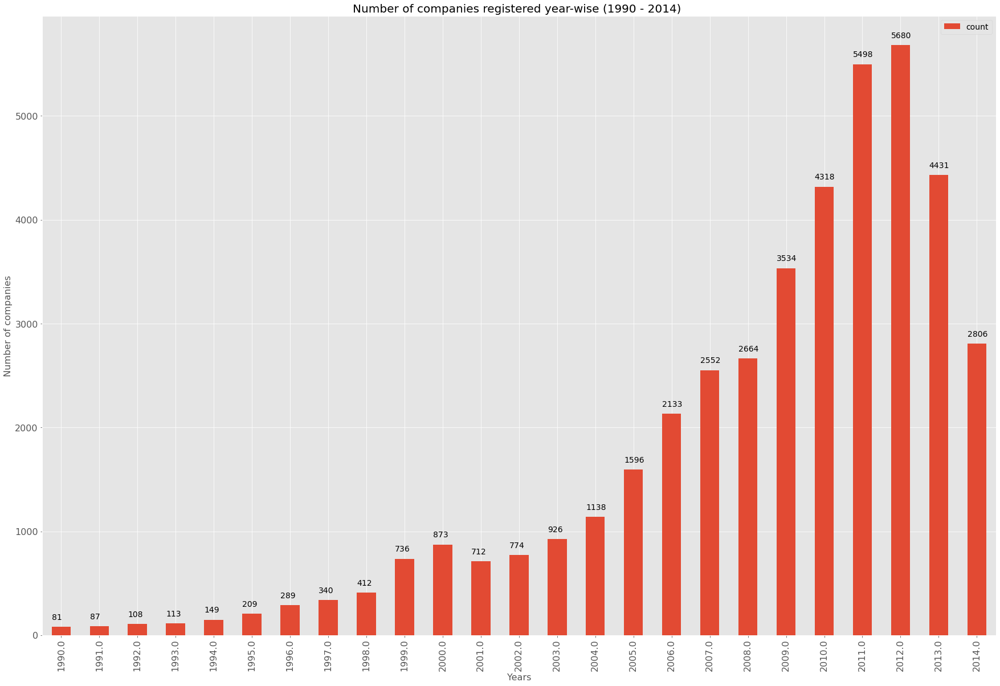

* The peak of startup registrations can be observed in 2012.

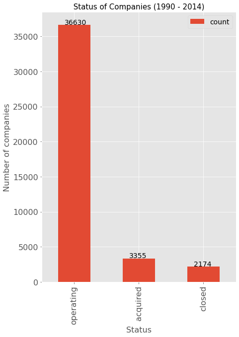

* only 5.1% startups were closed.

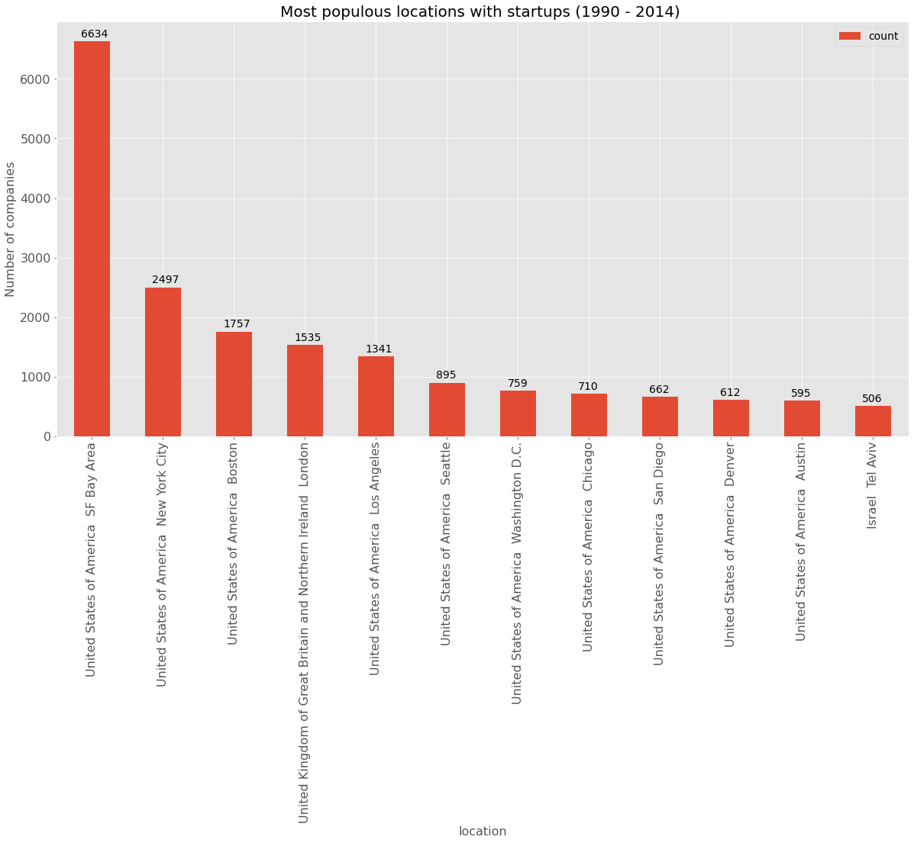

* Highest number of startups were founded in San Francisco Bay Area.

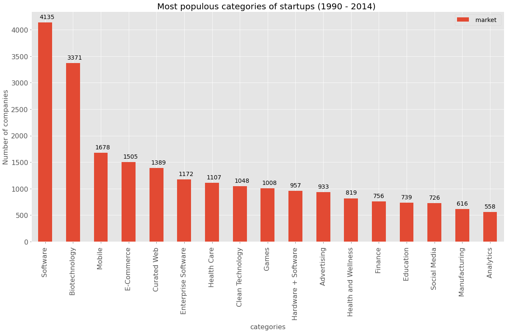

* Software has the highest number of startups.

* In total Renewable energy startups were funded more than other startup markets.
* Location wise West Sussex received the highest average funding. This tells us that number of startups in a location does not matter but the quality of startups define the amount of funding they would receive.
* Choose funding rounds factor to get an understand how much the investors are interested in a startup or how could number of funding round impact the growth of startups.

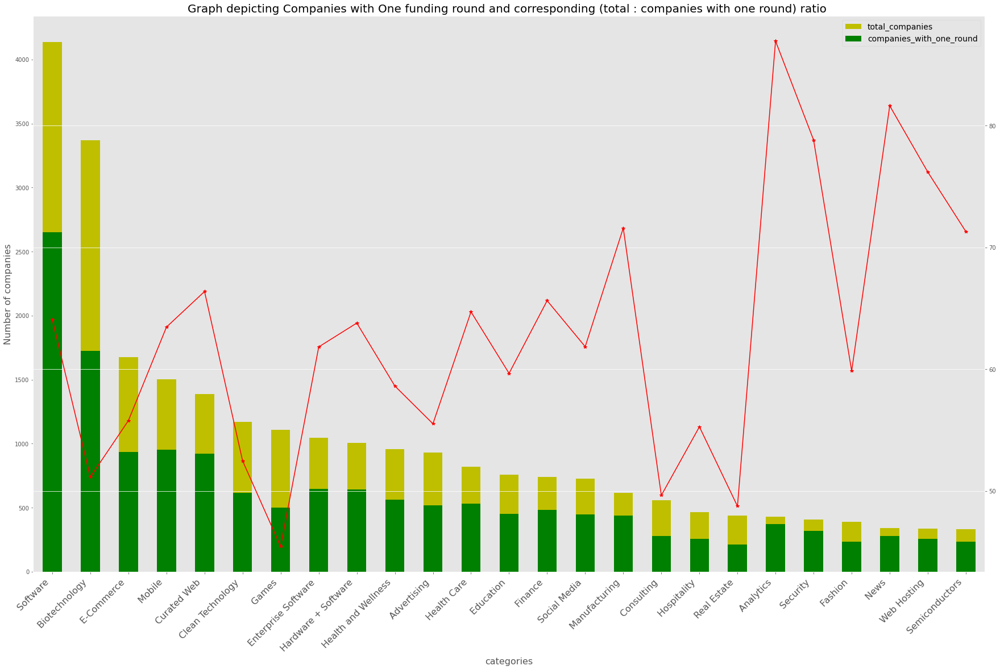

* Most (62.12%)of the companies were funded once.
* As the companies in a market becomes 1000 or less the chance of companies being funded once also increases with some irregularities.
* More than 85% of companies belonging to Analytics have been funded once.

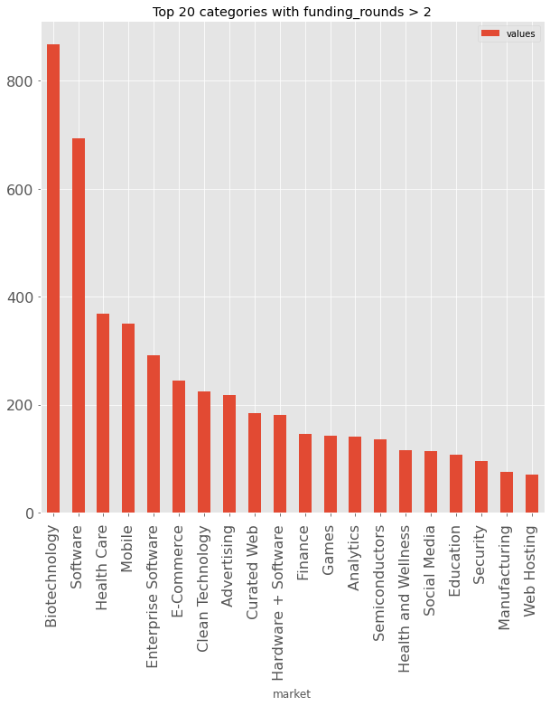

* Biotechnology has the highest number of companies with more than two funding rounds.
* Companies with One funding round.

    | Acquired | Closed | Operating |
    |----------|--------|-----------|
    |  5.96%   | 5.91%  |   88.1%   |

* Companies with funding round > 2.

    | Acquired | Closed | Operating |
    |----------|--------|-----------|
    |  12.2%   | 2.48%  |   84.8%   |

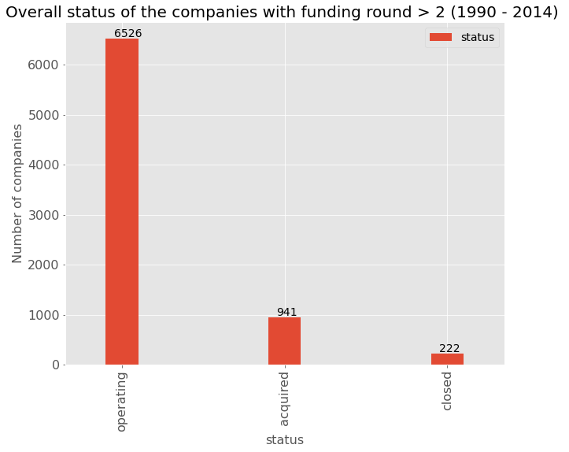

* From companies that have been funded once and more than twice , improvement can be seen in acquired percentage.

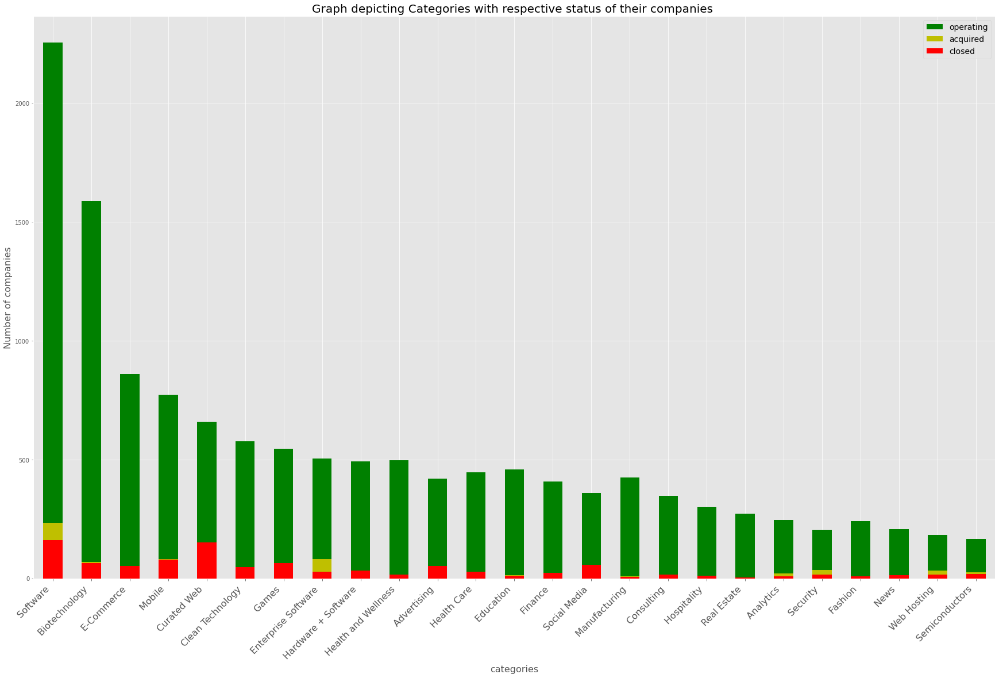

* From comparing the charts above and below, it can be said that above chart has a lot of red area (companies closed) and a lot of less light green area(acquired companies).

* Which is exactly opposite for the companies that have been funded more than twice i.e it can said that companies that were funded had more chance of getting acquired and less chance of getting closed.

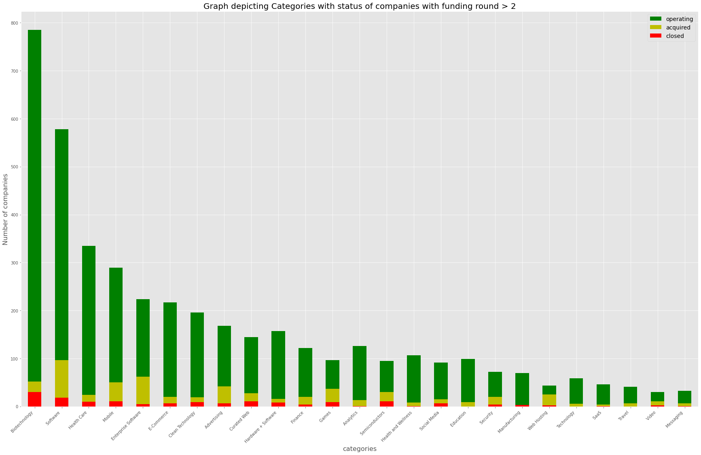

#### Location wise status of companies with one funding round.

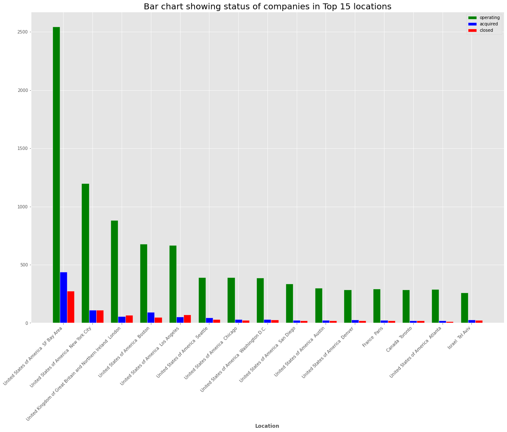

#### Location wise status of companies with more than two funding rounds.

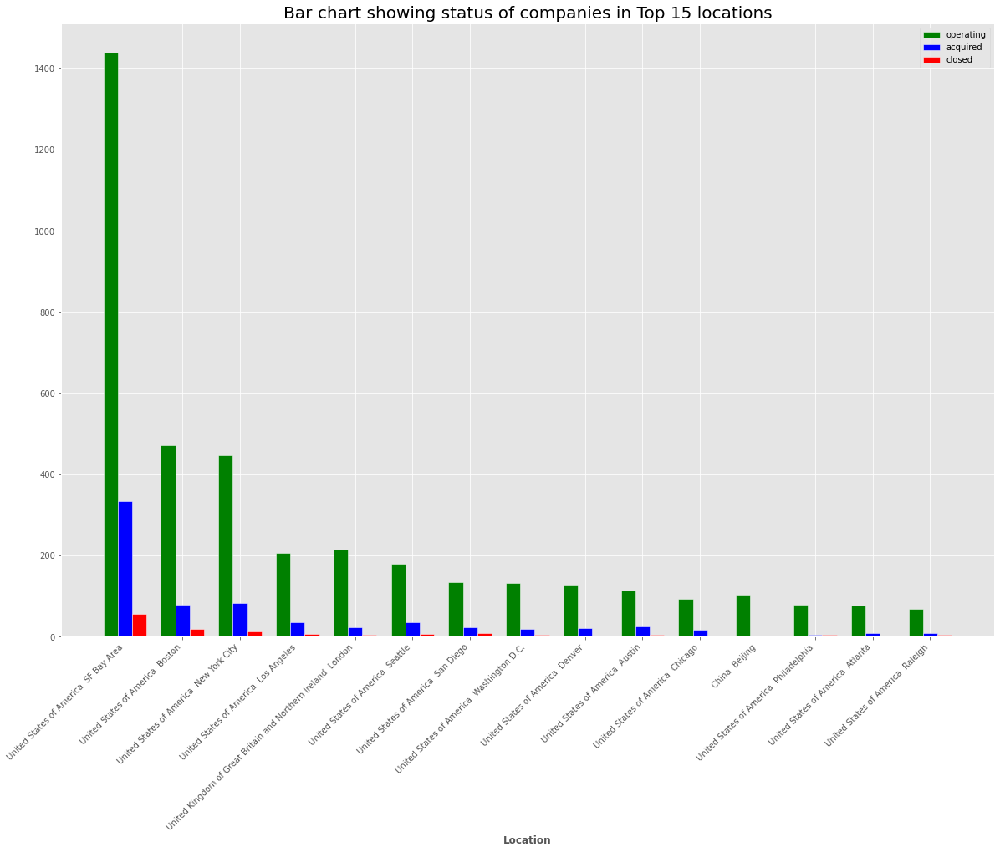

* By comparing the above two charts it can be said that increase in funding rounds not only increases successful companies in a specific market but also helps in increasing the success and acquiring percentage of companies in a location which consists of companies belonging to various categories.

* San Francisco Bay Area was the location where most number of startups were founded in each respective year.

#### Below are the maps showing the pointers on world map of companies that were closed, acquired, operating.

* Below is a map showing the pointers (with number of startups **closed**) in a location. This map was generated using folium library (for plotting the pointers) and foursquare api (getting the coordinates using location names). 

* The number shown gives a count of startups in the location which helps eliminate the congestion of pointers.

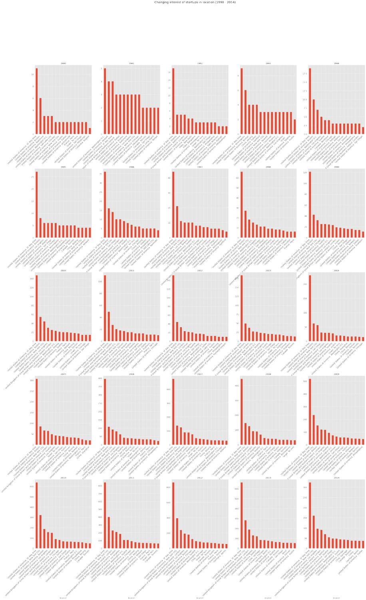

* Below is the map showing the locations in which the startups were **acquired**.

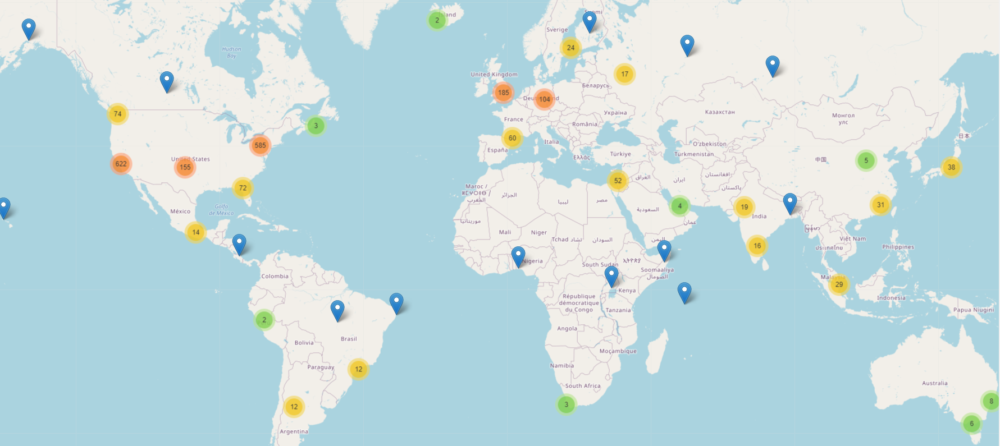

* Below is the map showing the locations in which the startups were **operating**.

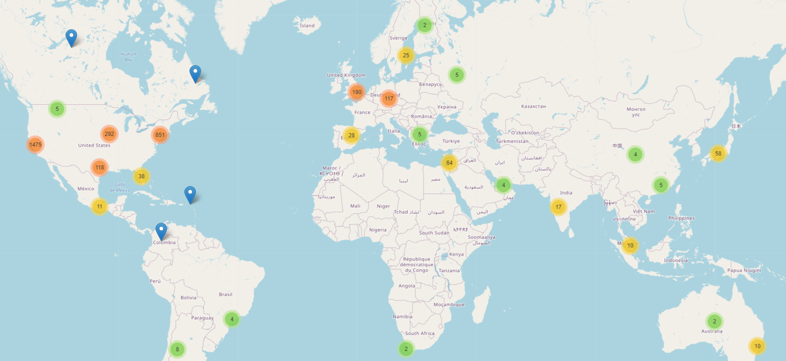

For interactive map and detailed analysis go check out my [code](https://colab.research.google.com/drive/1icr5DWB8N3hJ8smRnnldNdggwEw2jcVs?usp=sharing).

## Discussion

Everyone has different ideas and implementations. The way in which data will be used is important. Having clean data is also important. Without the data being clean and ready to use, it makes analysis difficult and messy. So I have spent some time performing the data cleaning in which I removed rows with many columns of missing data, created some columns for making analysis easy and fast. For example, location in this dataset was not perfect and was spread across three columns for which I combined them into a single column and making easy to deal with.

Performing analysis for each feature after cleaning the data helps us deciding on which feature is more important and can be a deciding factor in a startup's success or failure. From which I found that funding amount, funding rounds, locations, startup category have impact on a startup's success or failure and performed in-depth analysis on them.

As per my needs I wanted to know how and what factors impact a startup and decided on some of them from the dataset. But, if someone wanted to predict a startup's failure or success, their requirements might differ from me.

Upon cleaning the data, I wanted to plot the startups on world map. For that I should be able to convert the locations (names) into coordinated that can be mapped on world map. For this task I took the help of foursquare api and made some calls to get the locations of all the startups in the dataset. Folium is the library I used to plot the locations on world map.

As there are more than 30k rows in the dataset, I used joblib to store the coordinate values in variables for future use to avoid repeating the api calls as it takes a lot of time. For those who don't know what **joblib** is in short **a package that can be used to serialize any python variable so that it can reconstruct it's structure in future and use it as a normal variable.**

## Conclusion

In my study I found that for almost each year except one, San Francisco has the most number of registrations for startup. It can be said that San Francisco is a startup hub.

Software is the top most category with highest and increasing number of startups being registered under it.

The most important thing is If a company gets more number of funding rounds it has more chances to be successful or getting acquired.

## References

* [Foursquare API](https://developer.foursquare.com/)
* [How To Write Qualitative Data Analysis](https://helpwithdissertation.com/blog/how-to-write-qualitative-data-analysis/)
* [Discussion & Conclusion](https://penandthepad.com/write-conclusion-discussion-section-lab-2062895.html)
* [pandas everything](https://www.geeksforgeeks.org/introduction-to-pandas-in-python/)

