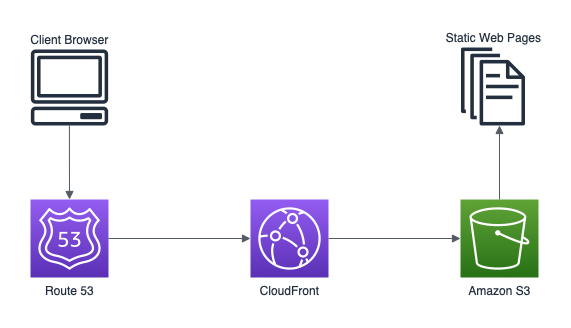

Embarking on the journey of hosting a static website is an exciting endeavor, especially when you're determined to harness the power and scalability of AWS. Throughout this guide, I'll share my hands-on experience of successfully hosting a static site on AWS S3, shedding light on the challenges I encountered and the strategies I employed to overcome them.

## Acquiring a Domain from Google Domains

The journey began with a simple yet crucial step: securing the perfect domain name through Google Domains. Navigating the user-friendly platform, I meticulously explored various domain name options, assessed their availability, and finally zeroed in on the domain that best suited my website's identity. The seamless process of acquiring a domain from Google set the stage for the forthcoming stages of my hosting endeavor.

## Transitioning Name Servers from Google to AWS

As the domain ownership was established, the next critical step was the seamless transition of the domain's name servers from Google to AWS. This transition ensures that the domain effectively directs traffic towards AWS resources, an essential aspect of a successful hosting setup. While the technical aspect might sound daunting, the process is simple:

    1. Accessing the Google Domain account.
    2. Locating the specific domain and navigating to its DNS settings.
    3. Replacing the existing name server addresses with those provided by AWS Route 53.

By completing this transition with precision, I laid the groundwork for the subsequent stages of hosting on AWS S3.

## Establishing a Host within AWS S3

With the domain poised and name servers aligned, I proceeded to establish an AWS S3 bucket as the host for my static files, the core components driving my website. This step involved meticulously uploading the essential HTML, CSS, and JavaScript files into the designated S3 bucket. As I delved into the settings of the S3 bucket, I activated the "Static Website Hosting" option, a crucial directive to S3 to serve these files as web pages. This transformation marked a pivotal shift in the trajectory of my hosting journey.

## Configuring Domain Routing in AWS Route 53

To ensure a seamless connection between my domain and S3-hosted content, I configured domain routing in AWS Route 53. This involved creating a new hosted zone for my domain and setting up the necessary DNS records. By accurately mapping my domain to the S3 bucket's endpoint, I established a clear path for visitors to access my website.

## Confronting the HTTP Challenge

My journey encountered an interesting twist when it came to confronting the HTTP challenge. As luck would have it, I had purchased a .dev domain, which inherently supports HTTPS by default. This meant that my website was already primed for a secure browsing experience, thanks to the domain's built-in SSL certificate. Unlike many other domains, the .dev extension ensures that all connections are encrypted from the start.

In addition to this advantage, I discovered that my .dev domain featured automatic redirection to HTTPS. This means that even if someone tried to access my site using "http://yourdomain.com," they would be automatically redirected to the secure version, "https://yourdomain.com." This default redirection not only enhances security but also simplifies the user experience, ensuring that visitors are always connected to the encrypted version of the site. This unique feature of the .dev domain provided an additional layer of convenience in ensuring a seamless, secure browsing journey for my visitors.

However, this default redirection to HTTPS introduced a new challenge when attempting to use the built-in "Static Website Hosting" feature of AWS S3. Since the .dev domain automatically redirected all HTTP requests to HTTPS, the static website hosting redirection rules provided by S3 were not effectively applied. As a result, visitors accessing my site via "http://yourdomain.com" were automatically redirected to the HTTPS version by the domain itself, bypassing the intended S3 redirection rules.

This unexpected conflict prompted me to reevaluate the hosting setup and explore alternative solutions to ensure that the user experience remained consistent and error-free. In the next steps of my journey, I delved into AWS CloudFront to establish a controlled and unified HTTPS experience for my static website, seamlessly aligning with the .dev domain's default redirection and providing a holistic solution for hosting and security.

## Empowering HTTPS with Amazon CloudFront

To transcend the HTTP limitation and provide a seamless, secure browsing experience, I harnessed the capabilities of Amazon CloudFront, a content delivery network (CDN) known for its prowess in enhancing website performance and security. Beyond its technical merits, CloudFront shines as an intermediary between the S3 bucket and end users, fostering an improved user experience.

The integration process encompassed:

    1. Initiating a CloudFront distribution in the AWS Management Console.
    2. Directing the distribution towards the S3 bucket as the primary origin.
    3. Configuring CloudFront to implement a custom SSL certificate tailored to my domain.

## The Journey Summarized

In a concise encapsulation, here's the chronology of actions I undertook to navigate the complexities of hosting a static website on AWS S3 while leveraging CloudFront's HTTPS capabilities:

    1. Procured a domain through Google Domains.
    2. Seamlessly transitioned domain name servers from Google to AWS's Route 53.
    3. Created an AWS S3 bucket as the repository for static files.
    4. Configured domain routing in AWS Route 53.
    5. Activated "Static Website Hosting" within the S3 bucket settings.
    6. Integrated Amazon CloudFront to facilitate HTTPS for the website.

My experience is a testament to the dynamic nature of website hosting, where challenges are opportunities to expand knowledge. With persistence and adaptability, hosting a static website on AWS S3 can evolve from a challenge into a rewarding achievement.